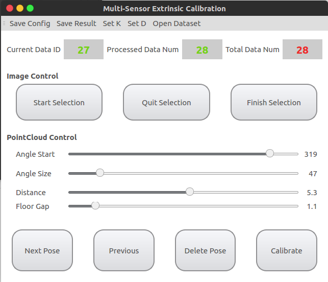
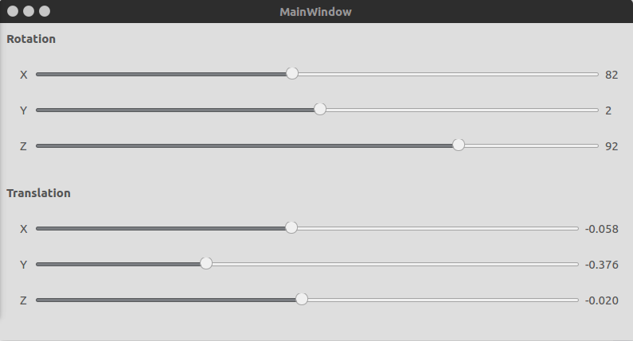
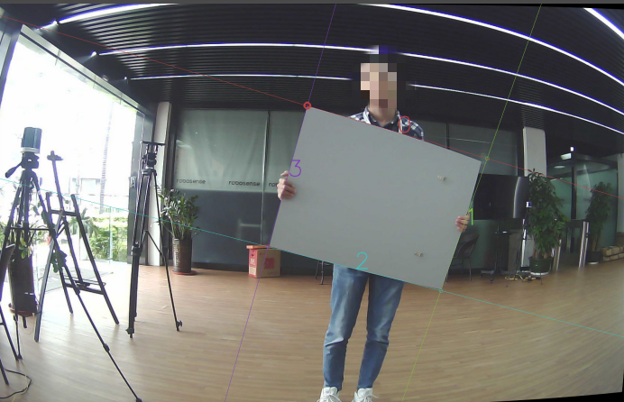
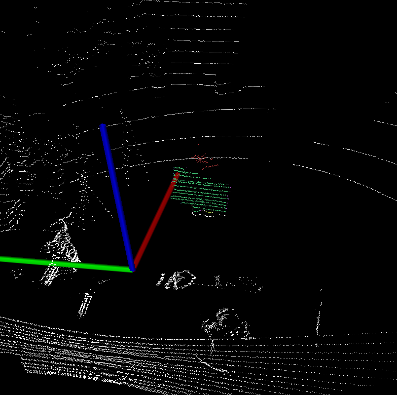

# PlyCal
> LIAO Qinghai  2019.2.25

本程序只实现了利用四边形板校准，暂未实现利用任意polygon的校准。  

## 准备  
如example文件夹所示，使用本软件需要一个config.json文件和图像、点云对应的文件。  
config.json：参考example/config.json，正常只需要修改其中相机的K、D。此文件路径无要求  
dataset：dataset指example下的`image_orig`和`pointcloud`，这两个文件夹名称不可以更改且必须在同一文件夹下。`image_orig`内需要有N(N>=4)张未反畸变的图片，`pointcloud`中有N份对应的pcd点云文件，二者应该时间上已经对应同步。  

## 操作  
1. 打卡config文件。在终端启动./PlyCal-qt后会直接进入config.json文件的选择。 
2. 打开dataset。如下图为主界面，点击`Open Dataset`选择保护`image_orig`和`pointcloud`的文件夹。主界面会显示总的数据帧数。  

3. 手动调整初值。打开dataset后主界面会隐藏，出现如下的调整初值的界面和一个显示点云的窗口、一个显示图像的窗口（此时点云会投影到图像、图像颜色也会投影到点云）。再下图的界面中手工条件rotation、translation且观察图像界面中的点云深度投影，OK是关掉下界面即可。

4. 手动条件polygon。返回主界面后，目前还不能第一次在点云和图像中都直接检测出四边形。对于图像，可以先点击`Start Selection`，然后鼠标在图片窗口中点击目标四边形的四个角点，完成后点击`Finish Selection`，正常检测结果如下图。对于点云，使用`Pointcloud Control`下的四个sliderbar来切割点云，缩小检测的范围，正常结果如下。

5. 检测。第一帧手动调整结束后，可以使用`Next Pose`来一帧一帧的处理下一帧，或者使用`Quick`快速处理，当数据检测结果不好时可以回到步骤4手动调整或者`Delete`
6. 校准。点击`Calibrate`调用校准优化，结果在终端有打印，也可以点击`Save Result`。config文件此时也可以保存（会覆写之前的config）。